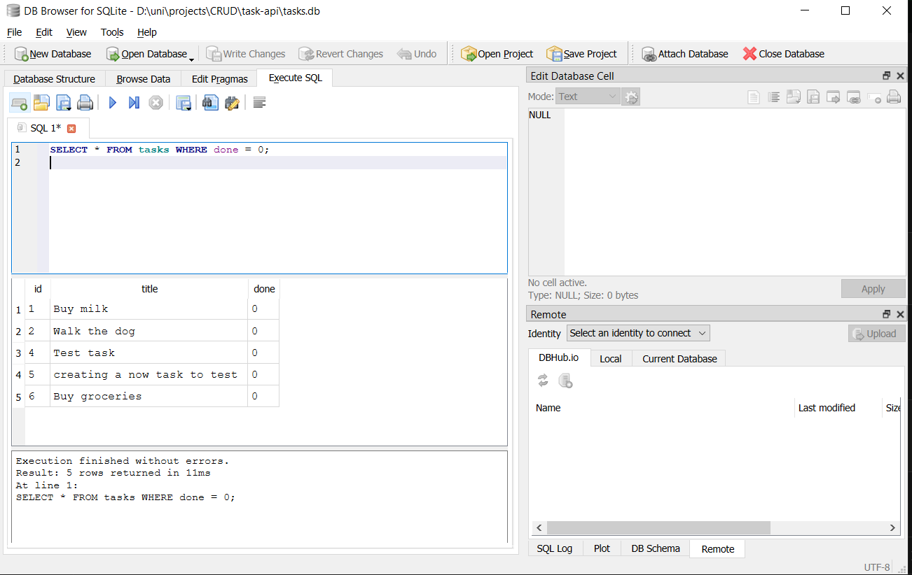
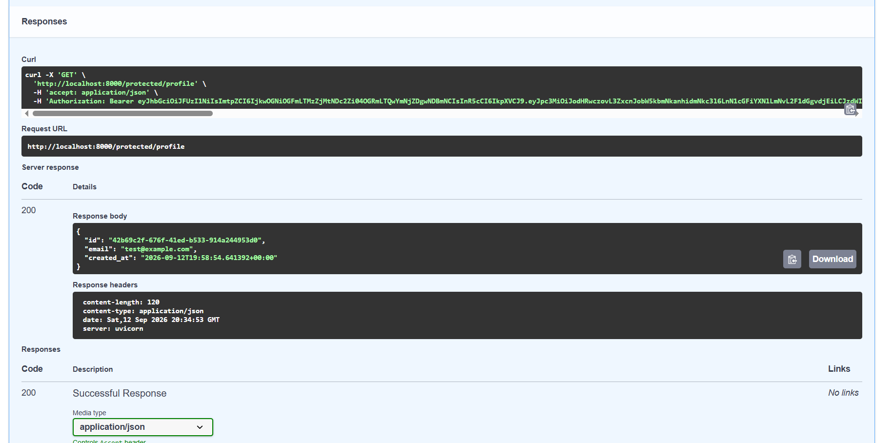

# Task API

A simple to-do list REST API built with FastAPI, running against a containerized
PostgreSQL database, with Supabase-backed authentication protecting select routes.
Started with one command via Docker Compose.

## Why Postgres in Docker

The app went from an in-memory list (gone on restart) to a SQLite file (single
machine only) to a real Postgres server running in a container. Docker means no
manual Postgres install, no version conflicts, and the exact same setup on any
machine. A named volume keeps the data on disk even when the containers are
torn down and recreated.

## Setup

1. Copy `.env.example` to `.env` and fill in your own Supabase project's URL
   and anon key (see **Authentication → Setup** below). The database defaults
   work out of the box for local dev.
2. Run:

```powershell
docker compose up
```

That's it — the app and database both start, the `tasks` table is created
automatically, and three example tasks are seeded on first run only.

Visit `http://localhost:8000/docs` for interactive Swagger UI.

## Environment variables

See `.env.example`. Three variables are required:

- `DATABASE_URL` — points the app at the `db` service inside the Docker network
- `SUPABASE_URL` — your Supabase project's URL
- `SUPABASE_KEY` — your Supabase project's anon/public key

## Endpoints

| Method | Path | Auth required | Purpose |
|---|---|---|---|
| GET | / | No | API info |
| GET | /health | No | Health check |
| GET | /tasks | No | List tasks (supports `?done=true` and `?search=milk`) |
| GET | /tasks/{id} | No | Get one task |
| POST | /tasks | No | Create a task |
| PUT | /tasks/{id} | No | Update a task |
| DELETE | /tasks/{id} | No | Delete a task |
| GET | /stats | No | Task counts (total/done/open) |
| POST | /reset | No | Reset to the 3 seed tasks |
| POST | /auth/signup | No | Create a new account |
| POST | /auth/login | No | Log in, get a JWT access token |
| POST | /auth/logout | Yes (Bearer token) | End the session |
| GET | /protected/profile | Yes (Bearer token) | Get your own user data |
| GET | /protected/dashboard | Yes (Bearer token) | Example of a second route reusing the same auth guard |
| GET | /public/info | No | Open, unauthenticated data |

## Example request

```
PS D:\uni\projects\CRUD> curl.exe --% -i -X POST http://localhost:8000/tasks -H "Content-Type: application/json" -d "{\"title\":\"Survive the restart\"}"
HTTP/1.1 201 Created
date: Sat, 12 Sep 2026 13:23:11 GMT
server: uvicorn
content-length: 51
content-type: application/json

{"id":4,"title":"Survive the restart","done":false}
```

## Proving persistence

Created a task, then ran a full stack teardown and rebuild:

```powershell
docker compose down
docker compose up
```

Confirmed via `psql` inside the running container:

```powershell
docker exec -it task-api-db-1 psql -U postgres -d tasks -c "SELECT * FROM tasks;"
```

```
 id |        title        | done
----+---------------------+------
  1 | Buy milk            | f
  2 | Walk the dog        | f
  3 | Write README        | t
  4 | Survive the restart | f
(4 rows)
```

All 4 tasks — including the one created before the restart — were still
there. The log line `PostgreSQL Database directory appears to contain a
database; Skipping initialization` on startup confirms the named volume kept
the actual data files on disk through a full container teardown, not just an
unbroken process.



## Architecture note

The API's routes never changed across three separate storage backends —
memory (A1), SQLite (A2), and now Postgres in Docker (A3). Only the functions
inside `get_db()` / `init_db()` and each route's queries changed. That
separation is the actual point of the assignment: storage is an
implementation detail behind a stable API.

## Notes

`init_db()` retries the database connection on startup, since Docker Compose's
`depends_on` only waits for the `db` container to *start*, not for Postgres
inside it to finish initializing — without the retry, the app can lose that
race and crash before Postgres is ready to accept connections.

## Authentication

This API uses Supabase Auth as its identity provider — it handles password
hashing and JWT signing; this server only ever verifies tokens Supabase issues.
No password is ever stored or hashed by this codebase.

### Setup

Create a free project at [supabase.com](https://supabase.com), then from
**Project Settings → API**, copy your Project URL and `anon` `public` key
into `.env`:

```
SUPABASE_URL=your_supabase_project_url
SUPABASE_KEY=your_supabase_anon_key
```

For local testing convenience, email confirmation is turned off in the
Supabase dashboard under **Authentication → Sign In / Providers → Email**,
so a fresh signup can log in immediately.

### Example: signup → login → protected call

**Signup:**
```
PS> curl.exe --% -i -X POST http://localhost:8000/auth/signup -H "Content-Type: application/json" -d "{\"email\":\"test@example.com\",\"password\":\"password123\"}"
HTTP/1.1 201 Created
content-type: application/json

{"id":"42b69c2f-676f-41ed-b533-914a244953d0","email":"test@example.com","created_at":"2026-09-12T19:58:54.641392+00:00", ...}
```

**Login:**
```
PS> curl.exe --% -i -X POST http://localhost:8000/auth/login -H "Content-Type: application/json" -d "{\"email\":\"test@example.com\",\"password\":\"password123\"}"
HTTP/1.1 200 OK
content-type: application/json

{"access_token":"eyJhbGciOiJFUzI1NiIsImtpZCI6...(truncated)","refresh_token":"ezur6xflo6hk"}
```

**Protected call, using the access token from login:**
```
PS> curl.exe -i http://localhost:8000/protected/profile -H "Authorization: Bearer $token"
HTTP/1.1 200 OK
content-type: application/json

{"id":"42b69c2f-676f-41ed-b533-914a244953d0","email":"test@example.com","created_at":"2026-09-12T19:58:54.641392+00:00"}
```

**Tampered token correctly rejected:**
```
PS> curl.exe -i http://localhost:8000/protected/profile -H "Authorization: Bearer $badtoken"
HTTP/1.1 401 Unauthorized
content-type: application/json

{"error":"Invalid or expired token"}
```

### Swagger UI

`/docs` shows a lock icon on every protected route. Click **Authorize**,
paste a raw access token (no "Bearer" prefix needed), then **Try it out**
on any protected route directly from the browser.



### A real bug this caught

Reusing a token *after* calling `/auth/logout` correctly returns 401 —
Supabase invalidates the session server-side, so the same JWT that worked
a minute earlier stops working immediately. Confirmed this by accident
while testing Stage 5 in Swagger: the token used to log out was then
rejected on the very next request, exactly as it should be.

### Middleware reuse

Token verification lives in one function, `get_current_user`, used as a
FastAPI dependency. `/protected/profile`, `/protected/dashboard`, and
`/auth/logout` all reuse it unchanged — adding a new protected route never
requires writing new auth logic, only adding `Depends(get_current_user)`.